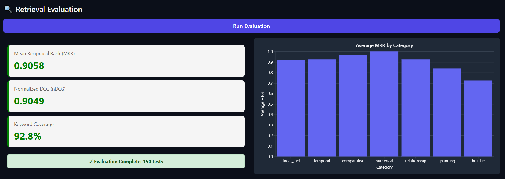
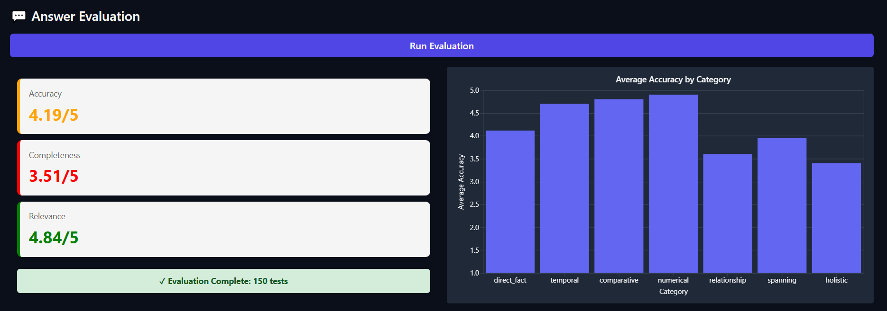

# InsureLLM RAG Challenge: The Relevance-Prioritized Truncation Approach

This document outlines the architecture of my high-performance **RAG (Retrieval-Augmented Generation)** pipeline, which was optimized through a systematic, data-driven process.

The final architecture is a **Two-Stage Retrieval Pipeline** (using a Bi-Encoder and a Cross-Encoder) that is coupled with a **Relevance-Prioritized Truncation** strategy.  
This strategy strictly enforces a **5,000-character context limit** *without sacrificing* the relevance gains achieved during retrieval.

---

## Data-Driven Diagnosis: Why This Architecture?

My design directly evolved from the empirical results of multiple evaluation phases.

### The Baseline Failure

The initial "naive" RAG (using simple chunking and basic vector search) failed on complex queries.

The baseline pipeline was:
1. Fragmenting coherent information during indexing.  
2. Failing to retrieve the right information for complex questions.
---

### The Indexing Fix

We replaced the `RecursiveCharacterTextSplitter` with `SemanticChunker`, which groups sentences based on meaning rather than character count.

- **Partial Success:** "Holistic" Accuracy improved from 2.6 → 3.4 / 5  
- **Critical New Failure:** **MRR dropped from 0.7228 → 0.6667**

This proved that **better chunks hurt retrieval** when the retriever (bi-encoder) was too weak to rank nuanced semantic representations.

---

### The Retrieval Solution

To solve the 0.6667 MRR, we implemented a **Two-Stage Retrieval System**:

1. **Stage 1 – Bi-Encoder (Fast Recall):**  
   Model: `all-MiniLM-L6-v2`  
   Retrieves a large (k=50), high-recall candidate list.
2. **Stage 2 – Cross-Encoder (High Precision):**  
   Model: `BAAI/bge-reranker-base`  
   Reranks candidates to select the top_n=3 most relevant documents.

**Results:**
- **MRR:** 0.6667 → **0.9058**
- **nDCG:** 0.6873 → **0.9049**
- **Answer Accuracy:** 3.81 → **4.42 / 5**

This validated that our retriever now yields a *high-confidence* ranking of relevant documents.

---

## The 5,000-Character Constraint & Solution

The challenge was to respect the 5,000-character limit *without* losing retrieval quality.  
Naively truncating or skipping long docs would destroy precision — so we created the **Relevance-Prioritized Truncation** algorithm.

### Core Principles

1. **Trust the Rank:** The system fully trusts the cross-encoder ranking.  
   The most relevant doc (`docs[0]`) is always considered first.
2. **Handle the First Document:**  
   - If it’s longer than 5,000 characters → truncate it and use only that.  
   - If it fits → include it and try to add more.
3. **Fill by Relevance:**  
   - Add subsequent documents (`docs[1]`, `docs[2]`, …) **only if they fit** within the remaining limit.  
   - Stop when the limit is reached.

This guarantees that the 5,000-character window is packed with *the most relevant possible content*, respecting retrieval order.

---

## Final Code Architecture

### `ingest.py`

The `RecursiveCharacterTextSplitter` was replaced with `SemanticChunker`.

```python
from langchain_experimental.text_splitter import SemanticChunker
from langchain_huggingface import HuggingFaceEmbeddings

embeddings = HuggingFaceEmbeddings(model_name="all-MiniLM-L6-v2")

def create_chunks(documents):
    text_splitter = SemanticChunker(embeddings)
    chunks = text_splitter.split_documents(documents)
    return chunks
```

---

### `answer.py`

Implements the `Two-Stage Retriever` and `Relevance-Prioritized Truncation` logic.

```python
from langchain_classic.retrievers.contextual_compression import ContextualCompressionRetriever
from langchain_classic.retrievers.document_compressors.cross_encoder_rerank import CrossEncoderReranker
from langchain_community.cross_encoders import HuggingFaceCrossEncoder

vectorstore = Chroma(persist_directory=DB_NAME, embedding_function=embeddings)

# Stage 1 – Bi-Encoder (High Recall)
base_retriever = vectorstore.as_retriever(search_kwargs={"k": 50})

# Stage 2 – Cross-Encoder (High Precision)
model_name = "BAAI/bge-reranker-base"
model = HuggingFaceCrossEncoder(model_name=model_name, model_kwargs={'device': 'cpu'})
compressor = CrossEncoderReranker(model=model, top_n=3)

retriever = ContextualCompressionRetriever(
    base_compressor=compressor,
    base_retriever=base_retriever
)

llm = ChatOpenAI(temperature=0, model_name=MODEL)

def fetch_context(question: str) -> list:
    """Retrieve relevant context using the two-stage retriever."""
    return retriever.invoke(question)

##Truncation Logic
for i, doc in enumerate(docs):
        doc_content = doc.page_content
        doc_length = len(doc_content)
        
        length_if_added = current_length + (separator_length if context_pieces else 0) + doc_length
        
        print(f"Considering Doc {i+1}/{len(docs)} (Length: {doc_length} chars). Current context length: {current_length}. Length if added: {length_if_added}")

        if length_if_added <= MAX_CONTEXT_LENGTH:
            context_pieces.append(doc_content)
            final_docs_used.append(doc) # Add doc to the list of used docs
            current_length = length_if_added
            print(f"Added Doc {i+1}. New context length: {current_length}")
        else:
            print(f"Skipping Doc {i+1} and subsequent docs (exceeds limit).")
            break # Stop adding documents if the limit is exceeded
```

---

## Results

### Retrieval Evaluation



### Answer Evaluation



---

## Installation

Please install the required packages before running the pipeline:

```bash
uv sync
uv pip install langchain-experimental langchain-classic langchain-community
```
